# Bot Architecture Guide

This project is a Node 24 + TypeScript WhatsApp sales bot for Andean Scapes. It uses Fastify for HTTP, WhatsApp Cloud API for customer messages, Telegram polling for owner/agent operations, SQLite for state, JSON skill files for business facts, and DeepSeek for live customer replies.

## Quick Map

| Area | Main Files | Purpose |
| --- | --- | --- |
| Startup | `src/server.ts`, `src/app.ts` | Load data, migrate DB, build Fastify, start Telegram/follow-up loops |
| WhatsApp ingress | `src/routes/whatsapp-webhook.route.ts` | Verify Meta webhook, extract messages, dedupe, route to bridge/handoff/bot |
| Customer chat brain | `src/services/response-engine.ts` | Main flow: guards, scoring, LLM, quote/handoff/media flags |
| LLM reply | `src/services/deepseek-client.ts`, `src/services/llm/*` | Build prompt from skills, call DeepSeek, return plain-text reply |
| Lead analysis | `src/services/lead-analyzer.ts` | Second DeepSeek call for intent/readiness/score delta |
| Skills/data | `src/services/skill-loader.ts`, `src/data/*.json`, `src/services/product-registry.ts` | Load/validate static JSON, merge dynamic R2 data, expose typed product facts |
| Telegram/admin | `src/services/telegram-bot.ts`, `src/commands/*`, `src/services/bridge-service.ts` | Owner commands, alerts, human bridge to WhatsApp |
| Persistence | `src/db/schema.sql`, `src/db/repositories/*` | SQLite schema and repository seam |
| Guards | `budget-guard.ts`, `time-window-policy.ts`, `media-service.ts`, `reply-guard.ts` | Cost, message rate, 24h, image caps, unsafe reply checks |

## Runtime Boot

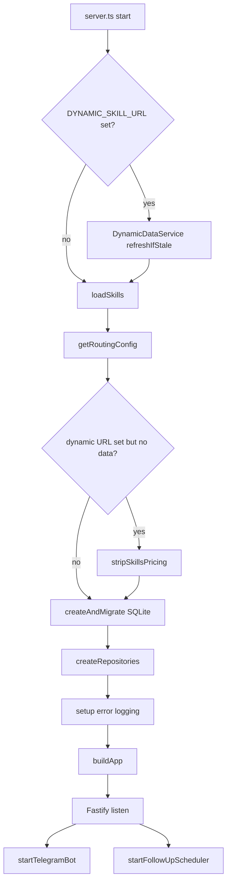

Key points:

- `env.ts` loads `.env.dev` by default, or `ENV_FILE` when set.
- `server.ts` calls `loadSkills()` before DB and HTTP server.
- Dynamic data is optional. If configured and unavailable at startup, static pricing/availability is stripped for safety.
- `buildApp()` registers rate limit, error handler, `/health`, `/webhooks/whatsapp`, and `/`.
- Telegram polling and follow-up scheduler start after Fastify is listening.

## High-Level Component Diagram

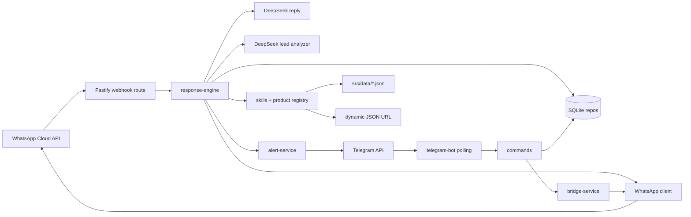

## Data Sources

### Static Skill Files

Static JSON lives in `src/data/`:

- `andean-scapes.skill.json`: business facts, experience, plans, route, availability, pricing rules, common questions.
- `sales-strategy.skill.json`: lead scoring signals, thresholds, owner alert template, sales tactics.
- `media.skill.json`: static media policy/images shape.
- `fallback-replies.json`: deterministic fallback and guard replies in `es` and `en`.

`skill-loader.ts` validates all of these with Zod. If a file violates schema, startup crashes.

### Dynamic Data

Dynamic JSON is fetched from `DYNAMIC_SKILL_URL` by `DynamicDataService`:

- Prices.
- Availability.
- Owner image.
- Plan images.
- Gallery images.
- Public payment facts.

Dynamic data is validated by `dynamic-data-schema.ts`, transformed to internal types, then merged into static skills by `skill-loader.ts`.

### Product Registry

`product-registry.ts` is access layer for business facts:

- `getActiveExperience()`.
- `getPlans()`.
- `getPricingItems()`.
- `isPricingAvailable()`.
- `isAvailabilityAvailable()`.
- `getOwnerImage()`.
- `getDynamicPlanImages()`.
- `getGalleryImages()`.
- `getPublicPaymentFacts()`.

Rule: services should use product registry instead of reading `skills.andeanScapes.experiences[0]` directly.

## Skill Loading Flow

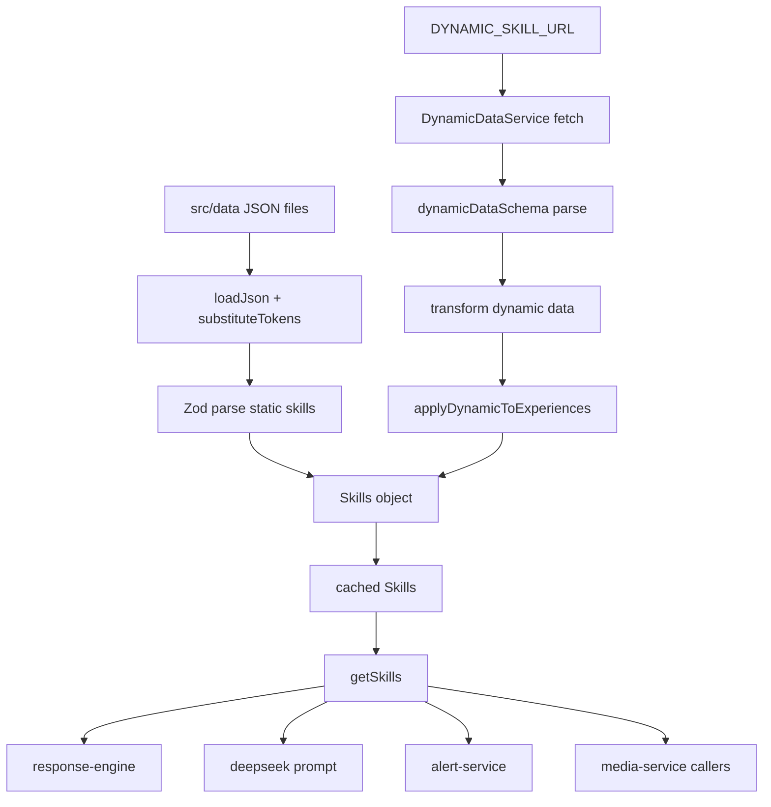

Important behavior:

- `{{OWNER_NAME}}` and `{{PARTNER_NAME}}` tokens are replaced from env.
- `refreshSkills(true)` runs non-blocking on first inbound of a new conversation.
- `refreshSkills(false)` runs for existing conversations and refreshes only if stale.
- If dynamic fetch fails while dynamic URL is configured, price/date/reservation messages get safe fallback instead of invented data.

## WhatsApp Webhook Flow

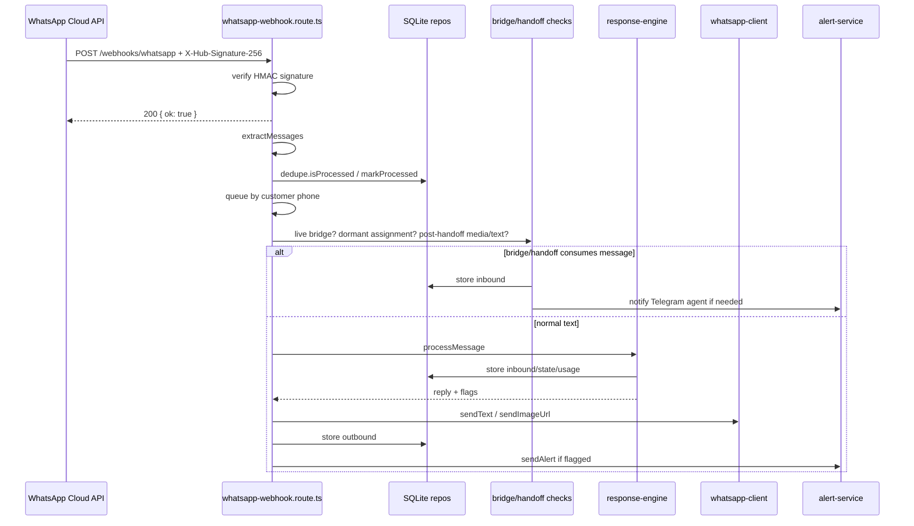

Webhook details:

- `GET /webhooks/whatsapp` handles Meta verification using `WHATSAPP_VERIFY_TOKEN`.
- `POST /webhooks/whatsapp` requires valid `X-Hub-Signature-256` using `WHATSAPP_APP_SECRET`.
- Route returns 200 before slow processing.
- Incoming messages are processed sequentially per phone using `processingPhones` map.
- Duplicate WhatsApp message IDs are ignored by `processed_webhook_messages`.
- Text, image, audio, and video can be extracted. Only text reaches bot brain. Media is forwarded only in bridge/handoff paths.

## Customer Chat Flow

`processMessage()` in `response-engine.ts` owns customer chat logic.

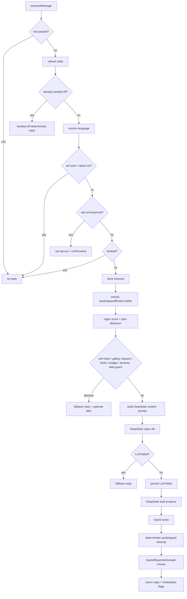

Main state collected:

- Language.
- Name.
- Plan.
- People.
- Date.
- Transport need.
- Pet.
- Lead score.
- Sales phase.
- Lead intent.
- Price-given timestamp.
- Handoff/soft-close/booked state.
- Gallery sent/nudged state.
- Lead pain.

## Deterministic vs LLM Flow

### Live Reply Source

DeepSeek is live customer reply source when budget and guards allow it. Deterministic FAQ `findIntent()` exists, but it is not called by live `processMessage()` reply path.

### Deterministic Pieces Still Active

Deterministic code still controls safety and business-critical behavior:

- Opt-out keyword detection.
- Bot pause check.
- Booked lead silence.
- Handed-off/bridge replies.
- Language resolution.
- Qualification field extraction from text/history.
- Regex backup scoring from `sales-strategy.skill.json`.
- Message rate limits.
- AI budget limits.
- Dynamic data unavailable guard.
- Price/date/reservation intent detection.
- Deterministic price quote override via `pricing-calculator.ts`.
- Unsafe reservation/policy leak guards.
- Media throttling and gallery rules.
- Owner alert selection.

### LLM Reply Call

`buildSystemPrompt()` builds prompt from:

- `deepseek-system.prompt.md`.
- Business facts from skills.
- Dynamic pricing/availability/payment facts when available.
- Sales tactics from `sales-strategy.skill.json`.
- Already collected customer fields.
- Current sales phase.
- Optional lead pain suffix.

`DeepSeekLlmClient` sends:

- System prompt.
- Recent conversation history.
- Latest customer message wrapped in `<customer_message>`.

Current reply parser treats DeepSeek output as plain text. It wraps result into an internal `LlmTurn` with default structured fields, so true structured extraction mostly comes from deterministic qualification logic and separate analyzer.

### Lead Analyzer Call

After reply succeeds, `lead-analyzer.ts` makes a second DeepSeek call when budget still allows it. It asks for strict JSON:

- Intent.
- Score delta.
- Confidence.
- Buying signals.
- Blockers.
- After-price interest.
- Reservation readiness.
- Rationale.

Result feeds `computeHybridScore()` with regex backup scoring.

## Scoring And Handoff

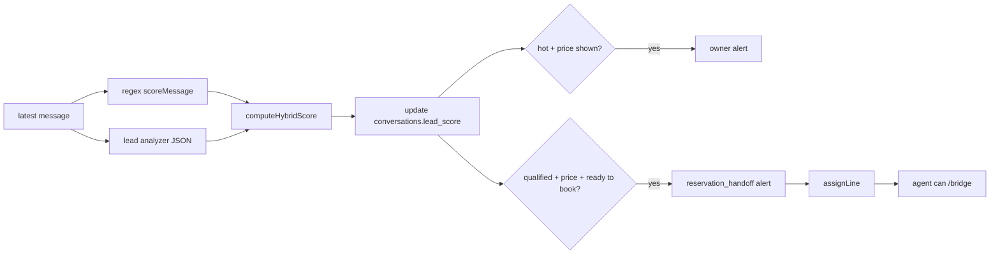

Bridge/handoff nuance:

- Alerts assign an owner line, but bot usually continues.
- Human bridge starts only when agent runs `/chat` or `/bridge`.
- `conversation_mode='bridge_active'` means bot stays silent and forwards inbound customer messages to Telegram agent.
- `conversation_mode='referred'` means lead is sent to another line and gets handed-off style replies.
- Stale bridge sessions expire after 12 hours and bot resumes.

## Media Flow

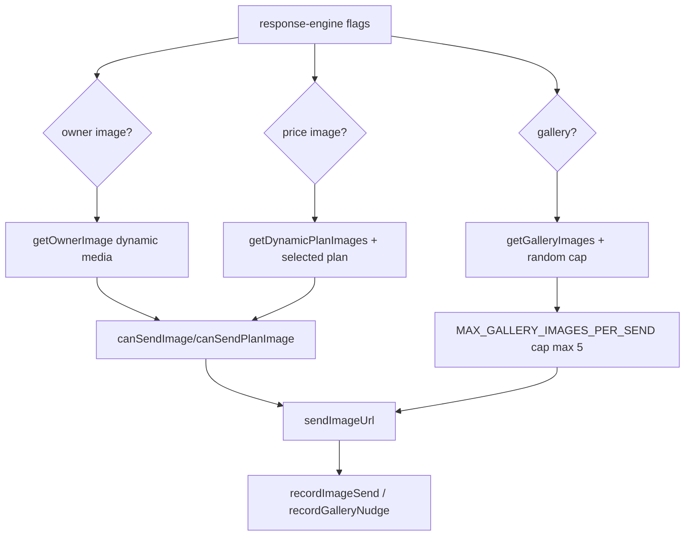

Media rules:

- `SEND_IMAGES_ENABLED` gates image sends.
- Same image ID is blocked for 72h by `media_sends`.
- Gallery is nudged once automatically per customer, but explicit photo requests can bypass that intro dedup.
- Gallery send count is capped by env and hard-capped to 5.
- Bridge media is different: Telegram agent uploads media to WhatsApp by bytes/media ID.

## Telegram Bot Architecture

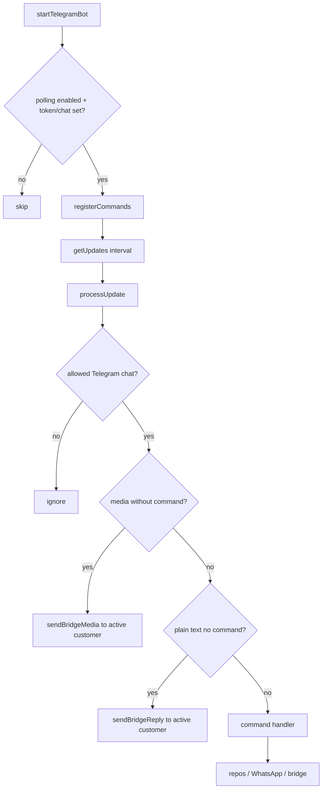

Telegram is not customer acquisition channel here. It is owner/admin/agent control plane.

Commands registered in `telegram-bot.ts` include:

- `/report`, `/summary`, `/daysummary`, `/stats`, `/status`.
- `/leads`, `/lead`, `/customer`, `/recent`, `/phases`.
- `/send`, `/chat`, `/bridge`, `/end`, `/retryflow`, `/returnbot`.
- `/booking`, `/block`, `/delete`, `/pause`, `/resume`, `/version`, `/help`.

Owner-only commands use `lead-routing.ts` access checks.

## Human Bridge Flow

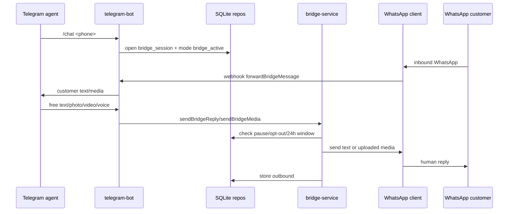

Guards on bridge sends:

- Bot pause blocks send.
- Opted-out customer blocks send.
- WhatsApp 24h service window blocks free-form send.
- Media size/type is normalized for WhatsApp.

## Database Shape

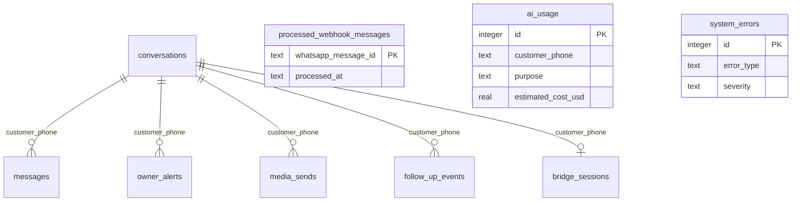

Important tables:

- `conversations`: customer profile, score, state flags, assignment, mode.
- `messages`: inbound/outbound transcript.
- `processed_webhook_messages`: dedupe.
- `ai_usage`: budget and cost tracking.
- `owner_alerts`: alert dedupe/cooldown history.
- `media_sends`: image dedupe.
- `bridge_sessions`: active Telegram agent bridge.
- `follow_up_events`: follow-up sequence state.
- `system_errors`: operational errors.

## External APIs

### WhatsApp Cloud API

Used by `whatsapp-client.ts`:

- Send text.
- Send image URL.
- Download inbound media.
- Upload agent media.
- Send uploaded media by ID.

Security notes:

- Webhook POST requires HMAC SHA-256 signature verification.
- Inbound media URL host is allowlisted before bearer token is attached.
- Token is not logged.

### Telegram Bot API

Used by `telegram-bot.ts` and `alert-service.ts`:

- Long polling via `getUpdates`.
- Send messages/photos/voice.
- Download Telegram files for bridge media.

### DeepSeek API

Used by `deepseek-completion.ts`:

- Shared completion transport.
- Zod validates API envelope.
- Returns `null` on transport/HTTP/validation/empty-content failure.
- Caller chooses fallback.

## Main Safety Guards

| Guard | File | Effect |
| --- | --- | --- |
| HMAC webhook signature | `whatsapp-webhook.route.ts` | Reject spoofed POSTs |
| Dedupe | repos + route | Ignore repeated Meta messages |
| Per-phone queue | route | Prevent same-customer race/order issues |
| Opt-out | `response-engine.ts`, repos | Stop automated replies after opt-out |
| Bot pause | repos + services | Silence bot and bridge sends |
| Booked state | `response-engine.ts` | No bot reply after conversion |
| Time limits | `time-window-policy.ts` | Limit bot messages per hour/day |
| 24h service window | `time-window-policy.ts` | Block free-form human bridge sends after window |
| Budget guard | `budget-guard.ts` | Stop AI calls by cost/call caps |
| Dynamic data guard | `response-engine.ts` | Avoid price/date hallucination when R2 data stale |
| Reply guards | `reply-guard.ts` | Detect unsafe reservation/prompt leak/truncation/soft close |
| Media caps | `media-service.ts` | Avoid duplicate image/gallery spam |
| Alert cooldown | `alert-service.ts` | Avoid repeated owner alerts |

## Mental Model For Modifying Bot

Use this order when changing behavior:

1. Business facts, prices, dates, route, plans: edit JSON skill/dynamic data, not TypeScript.
2. Prompt behavior/tone: edit prompt or sales strategy JSON first.
3. Hard safety/business rules: edit `response-engine.ts` or specific guard service.
4. WhatsApp transport/webhook behavior: edit route/client only.
5. Telegram admin behavior: edit command handler or `telegram-bot.ts`.
6. DB shape/state: edit schema, repos, tests together.

Most dangerous files:

- `response-engine.ts`: large central orchestrator. Small changes can affect every customer reply.
- `skill-loader.ts`: schema/cache/merge source. Changes can break startup or business facts.
- `whatsapp-webhook.route.ts`: delivery, dedupe, bridge, alert wiring.
- `alert-service.ts` and `lead-routing.ts`: owner assignment and alert delivery.
- `pricing-calculator.ts`: deterministic quote source.

## Validation Commands

Project scripts from `package.json`:

```bash
npm run typecheck
npm run lint
npm test
npm run build
npm run validate:skills
npm run validate:dynamic -- <path-to-dynamic.json>
npm run simulate -- "Hola, cuanto vale el tour?"
```

For docs-only changes, no TypeScript validation is required. For behavior changes, run at least `npm run typecheck`, targeted tests, `npm run validate:skills`, and one `npm run simulate` snapshot relevant to changed flow.

## Inbound Message Priority Order

Think of every WhatsApp customer text as passing through layers. The bot does not first choose between deterministic or LLM. It first runs deterministic guards and state capture. Only if nothing blocks the message does it call DeepSeek.

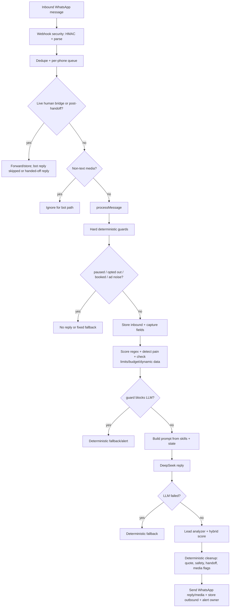

Step order from one incoming customer text:

1. Webhook validates the request before bot logic: HMAC signature, JSON shape, message extraction.
2. Message is deduped by WhatsApp message ID.
3. Same customer messages are queued so replies stay ordered.
4. Bridge/handoff checks run before AI. If a human bridge is active, bot stays silent and forwards to Telegram agent.
5. Only text enters `processMessage()`. Images/audio/video do not get LLM replies unless handled by bridge/handoff forwarding.
6. `processMessage()` checks deterministic hard stops: paused bot, handed-off state, ad noise, opted-out user, opt-out keywords, booked user.
7. If not stopped, inbound text is stored in `messages`.
8. Deterministic extraction captures known facts: language, name, plan, people, date, transport, pet, pain signals.
9. Deterministic scoring runs with regex signals from `sales-strategy.skill.json`.
10. Deterministic guards decide if LLM is allowed: message limits, AI budget, dynamic pricing/date availability, soft-close, gallery request, follow-up pain reply.
11. If a guard blocks LLM, response is deterministic from `fallback-replies.json`, or no reply, or owner alert.
12. If LLM is allowed, `buildSystemPrompt()` builds DeepSeek context from JSON skills, dynamic data, collected customer fields, sales phase, and recent history.
13. DeepSeek generates the customer-facing reply. It answers using facts from the skills/prompt.
14. If DeepSeek fails, deterministic fallback reply is used.
15. If DeepSeek succeeds, a second DeepSeek call may run for lead analysis, budget permitting.
16. Final score is computed from analyzer result plus regex backup score.
17. After LLM, deterministic post-processing can override or clean reply: price quote, price gate, unsafe reservation claim, prompt leak, repeated questions, handoff/payment close, image/gallery flags.
18. Webhook sends final text through WhatsApp, stores outbound message, sends images if flags allow, then sends owner alert if flagged.

Priority summary:

- Deterministic guards always run before LLM.
- Deterministic data capture happens before LLM so the prompt knows what is already known.
- LLM is primary free-text reply source only after guards pass.
- Deterministic FAQ `findIntent()` is not used in live replies.
- Deterministic fallback replies are used when LLM is blocked, fails, or safety rules override output.
- Skills JSON feeds both deterministic logic and LLM prompt. The LLM does not fetch JSON directly; `skill-loader` loads/validates/merges data, then `buildSystemPrompt()` turns it into prompt context.

## AI Agent Setup vs Bot Skills

This project has two separate concepts both called "skills". They serve different audiences and live in different places.

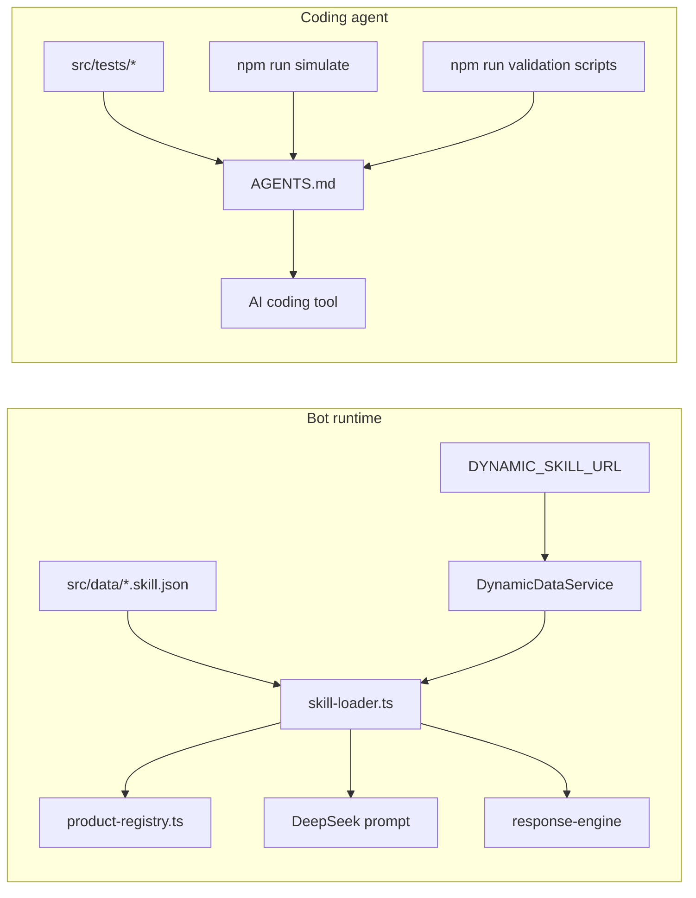

### Bot skills (runtime business data)

These provide the bot with facts about the tour business. They are the single source of truth for pricing, plans, route, availability, and fallback replies.

| File | Purpose | Loaded by |
| --- | --- | --- |
| `src/data/andean-scapes.skill.json` | Business: experience, plans, route, FAQs, pricing rules | `skill-loader.ts` at startup |
| `src/data/sales-strategy.skill.json` | Scoring signals, thresholds, alert template, sales tactics | `skill-loader.ts` at startup |
| `src/data/media.skill.json` | Media policy shape | `skill-loader.ts` at startup |
| `src/data/fallback-replies.json` | Guard/fallback replies in es + en | `skill-loader.ts` at startup |
| `DYNAMIC_SKILL_URL` env var | Live prices, availability, images, payment facts | `DynamicDataService` merged into skills |

Bot skills flow:

1. `skill-loader.ts` reads `.json` files, puts through Zod, exports `Skills` type.
2. `product-registry.ts` wraps access so callers do not reach `skills.andeanScapes.experiences[0]` directly.
3. `buildSystemPrompt()` in `deepseek-client.ts` turns skills into DeepSeek context.
4. `DynamicDataService` periodically fetches and merges live data from R2/CDN.
5. `stripSkillsPricing()` blanks pricing/availability when dynamic URL is configured but data is unreachable.

Validation commands for bot skills:

```bash
npm run validate:skills          # all JSON skill files
npm run validate:prompt          # system prompt
npm run validate:dynamic -- <file>  # dynamic JSON from R2
```

### Coding-agent setup (instructions for AI tools)

This repo uses `AGENTS.md` as the main contract for any AI coding assistant, with thin tool-specific wrappers committed for teams that use OpenCode, Claude Code, Cursor, or GitHub Copilot.

What exists:

| File | Role |
| --- | --- |
| `AGENTS.md` | Primary agent instructions (invariants, phases, guardrails, test commands) |
| `CLAUDE.md` | Thin Claude pointer back to `AGENTS.md` |
| `.opencode/commands/` | Shared OpenCode slash commands: `/start-feature`, `/plan-detail` (or `/plan`), `/review` |
| `.claude/skills/*/SKILL.md` | Shared Claude/OpenCode-compatible skills: start-feature, plan-detail, review |
| `.cursor/rules/00-core.mdc` | Cursor pointer back to `AGENTS.md` and architecture docs |
| `.github/copilot-instructions.md` | GitHub Copilot pointer back to `AGENTS.md` |
| `.claude/settings.local.json` | Local Claude Desktop permissions (gitignored) |

What does **not** exist (on purpose):

- No multi-turn LLM eval harness separate from unit tests.
- No golden-conversation scoreboard or prompt regression suite.

### How an AI coding agent should work in this repo

1. Read `AGENTS.md` first.
2. Change business facts in JSON skill files, not TypeScript.
3. After any code change, run the safety gate:

   ```bash
   npm run typecheck && npm run lint && npm test && npm run build
   ```

4. For changes touching the reply path, also run:

   ```bash
   npm run validate:skills
   npm run simulate -- "Hola, cuanto vale el tour?"
   ```

5. If `npm run simulate` output changes, verify the diff is expected.
6. Never log these secrets: `WHATSAPP_ACCESS_TOKEN`, `DEEPSEEK_API_KEY`, `WHATSAPP_APP_SECRET`, `TELEGRAM_BOT_TOKEN`, `ADMIN_SECRET`.
7. Bind Fastify to `127.0.0.1` only.
8. Never use `any`.
9. One concern per PR.
10. CI must stay green.

### Existing regression safety net

| Tool | What it protects |
| --- | --- |
| `npm test` | ~38 Vitest test files; big one: `response-engine.test.ts` |
| `npm run simulate` | Offline reply path snapshot (AI_ENABLED=false) |
| `npm run typecheck` | Strict TypeScript across all service/route/repo code |
| `npm run lint` | ESLint conventions |
| `npm run scan:secrets` | secretlint against committed files |
| `npm run build` | Produces valid `dist/` before deploy |
| `npm run validate:dynamic` | Dynamic JSON from R2 against Zod schema |

No separate AI-agent eval harness exists: tests and simulate are the harness shared by humans and coding tools alike.
