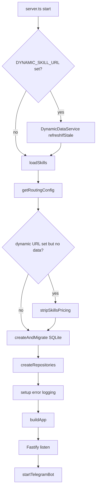
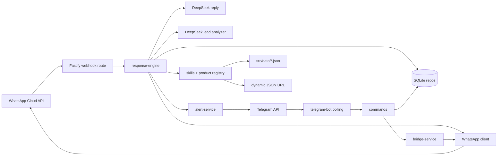
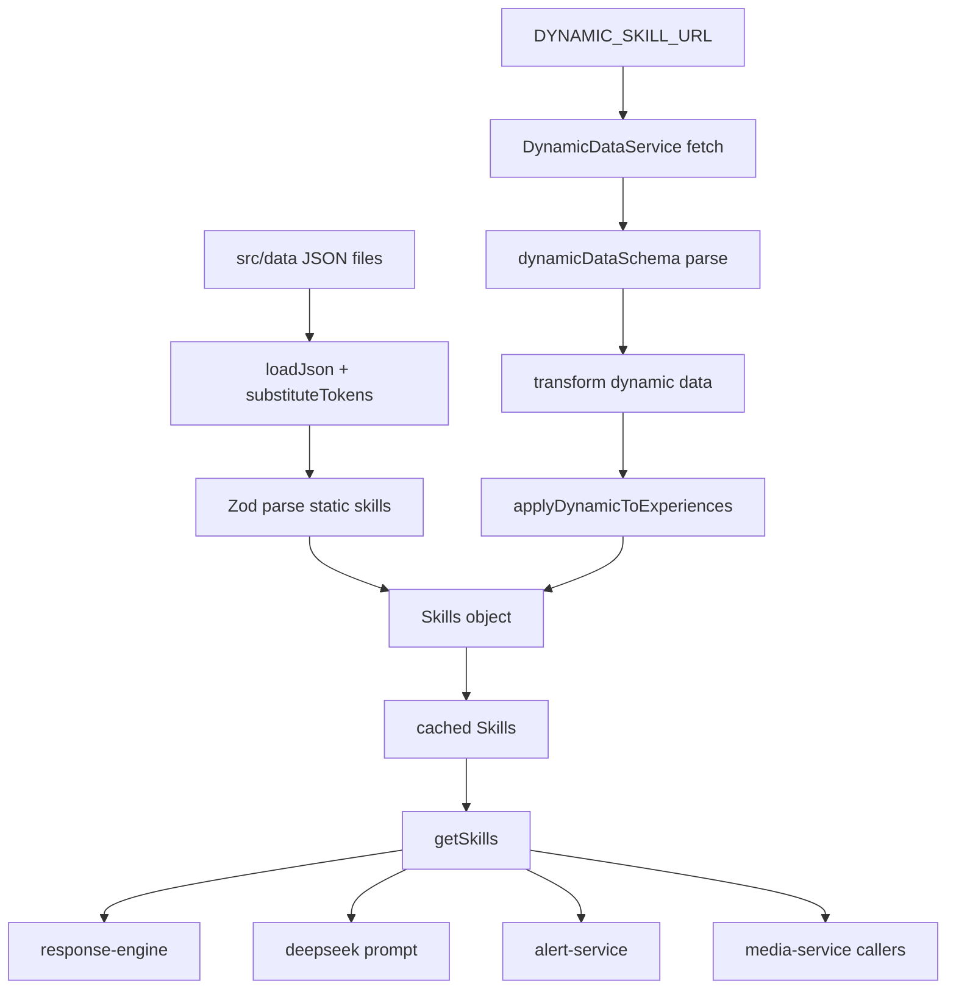
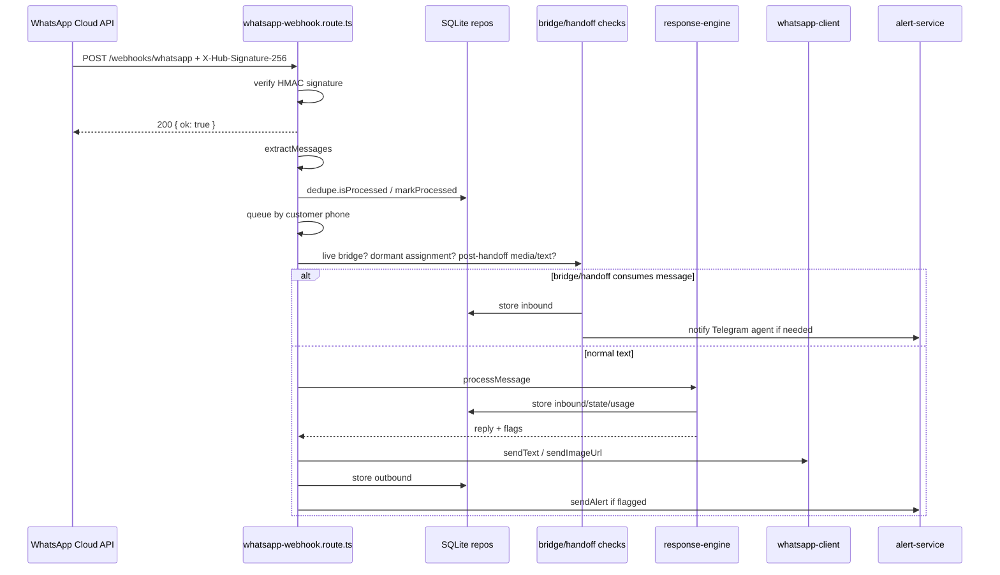
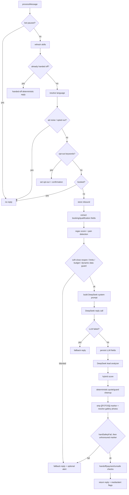
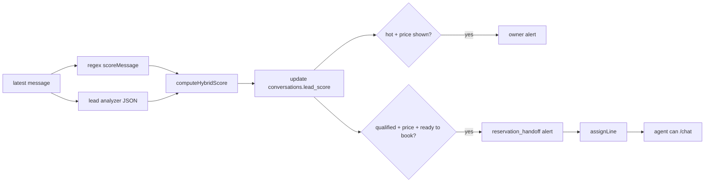
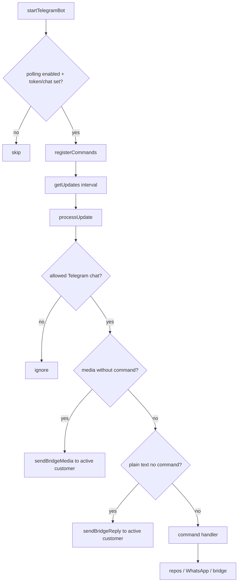
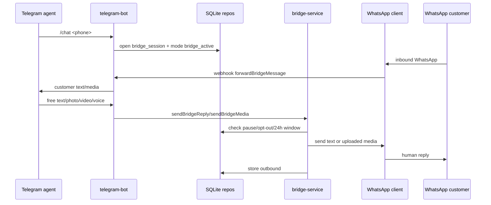
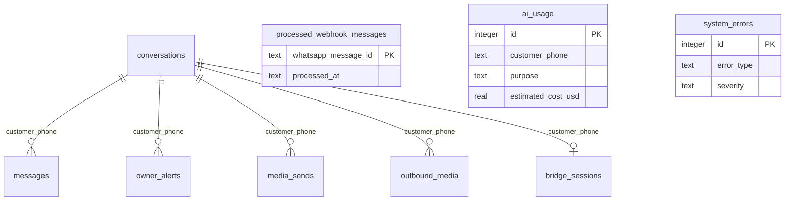
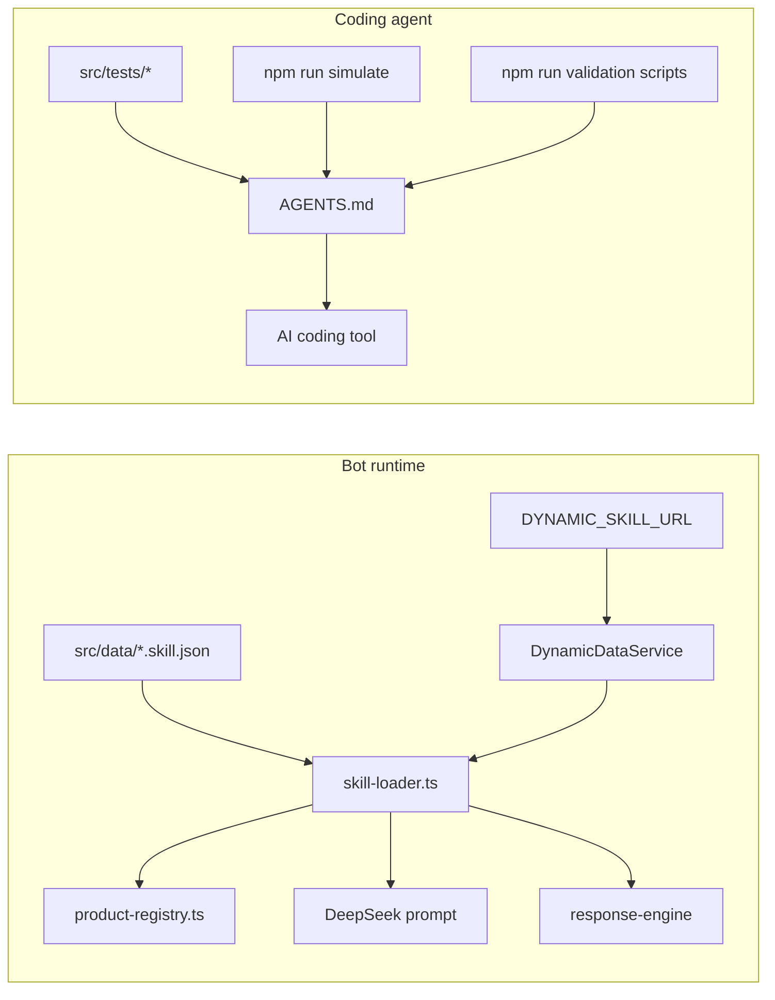

# Bot Architecture Guide

This project is a Node 24 + TypeScript WhatsApp sales bot for Andean Scapes. It uses Fastify for HTTP, WhatsApp Cloud API for customer messages, Telegram polling for owner/agent operations, SQLite for state, JSON skill files for business facts, and DeepSeek for live customer replies.

## Quick Map

| Area | Main Files | Purpose |
| --- | --- | --- |
| Startup | `src/server.ts`, `src/app.ts` | Load data, migrate DB, build Fastify, start Telegram polling |
| WhatsApp ingress | `src/routes/whatsapp-webhook.route.ts` | Verify Meta webhook, extract messages, dedupe, route to bridge/handoff/bot |
| Customer chat brain | `src/services/response-engine.ts` | Main flow: guards, scoring, LLM, quote/handoff/media flags |
| LLM reply | `src/services/deepseek-client.ts`, `src/services/llm/*` | Build prompt from skills, call DeepSeek, return plain-text reply |
| Lead analysis | `src/services/lead-analyzer.ts` | Second DeepSeek call for intent/readiness/score delta |
| Skills/data | `src/services/skill-loader.ts`, `src/services/dynamic-data-service.ts`, `src/services/product-registry.ts` | Validate brand/config JSON, fetch/validate/transform the dynamic product catalog, expose typed product facts |
| Telegram/admin | `src/services/telegram-bot.ts`, `src/commands/*`, `src/services/bridge-service.ts` | Owner commands, alerts, human bridge to WhatsApp |
| Persistence | `src/db/schema.sql`, `src/db/repositories/*` | SQLite schema and repository seam |
| Guards | `budget-guard.ts`, `time-window-policy.ts`, `media-service.ts`, `reply-guard.ts` | Cost, message rate, 24h, image caps, unsafe reply checks |
| Operator notices | `src/services/owner-notice.ts` | Telegram notice deduped to once per customer per day per type |

## Runtime Boot


```mermaid
flowchart TD
  A[server.ts start] --> B{DYNAMIC_SKILL_URL set?}
  B -- yes --> C[DynamicDataService refreshIfStale]
  B -- no --> D[loadSkills]
  C --> D[loadSkills]
  D --> E[getRoutingConfig]
  E --> F{dynamic URL set but no data?}
  F -- yes --> G[stripSkillsPricing]
  F -- no --> H[createAndMigrate SQLite]
  G --> H
  H --> I[createRepositories]
  I --> J[setup error logging]
  J --> K[buildApp]
  K --> L[Fastify listen]
  L --> M[startTelegramBot]
```

Key points:

- `env.ts` loads `.env.dev` by default, or `ENV_FILE` when set.
- `server.ts` calls `loadSkills()` before DB and HTTP server.
- Dynamic data is optional. If configured and unavailable at startup, static pricing/availability is stripped for safety.
- `buildApp()` registers rate limit, error handler, `/health`, `/webhooks/whatsapp`, and `/`.
- Telegram polling starts after Fastify is listening, then the follow-up scheduler
  (`startFollowupScheduler`, a no-op unless at least one of
  `ALLOW_FOLLOWUP_TEMPLATE` / `FOLLOWUP_CONSENT_ASK_ENABLED` /
  `FOLLOWUP_RECURRING_ENABLED` is true); both intervals are cleared on graceful shutdown.
- Docker binds Fastify to `0.0.0.0` only inside the Compose network; `compose.yml` publishes the port on host `127.0.0.1` only.

## High-Level Component Diagram


```mermaid
flowchart LR
  WA[WhatsApp Cloud API] --> WH[Fastify webhook route]
  WH --> RE[response-engine]
  RE --> DS[DeepSeek reply]
  RE --> LA[DeepSeek lead analyzer]
  RE --> SK[skills + product registry]
  RE --> DB[(SQLite repos)]
  RE --> WC[WhatsApp client]
  WC --> WA
  RE --> AL[alert-service]
  AL --> TG[Telegram API]
  TG --> TB[telegram-bot polling]
  TB --> CMD[commands]
  CMD --> DB
  CMD --> BR[bridge-service]
  BR --> WC
  SK --> JSON[src/data/*.json]
  SK --> R2[dynamic JSON URL]
```

## Data Sources

### Static Skill Files

Static JSON lives in `src/data/`:

- `andean-scapes.skill.json`: brand-only facts (`experiences: []`); it is not a product fallback.
- `sales-strategy.skill.json`: lead scoring signals, thresholds, owner alert template, and runtime sales data.
- `media.skill.json`: static media policy/images shape.
- `fallback-replies.json`: deterministic fallback and guard replies in `es` and `en`.

`skill-loader.ts` validates all of these with Zod. If a file violates schema, startup crashes.

### Prompt Skill Files

Prompt files in `src/prompts/` define the LLM's personality and sales protocol:

- `seller-personality.skill.md`: Seller identity, voice, formatting, humor, and trust rules.
- `entry-strategy.skill.md`: How to consume a detected campaign segment. Must precede `cold-info-handler`.
- `cold-info-handler.skill.md`: First-turn structure for cold information/price leads.
- `whatsapp-sales.skill.md`: Sales methodology (how to sell). Never contains prices, dates, or plan names.
- `andean-scapes.skill.md`: Brand + catalog protocol. Multi-experience ready.
- `dynamic-context.template.md`: Renders `{{CATALOG}}` (static narrative) and `{{BUSINESS_DATA}}` (live prices/dates).
- `SKILLS-ASSEMBLY.md`: Assembly rules for coding agents. NOT sent to DeepSeek.

See `docs/skills-architecture.md` for the full assembly contract.

### Dynamic Data

Dynamic JSON is fetched from `DYNAMIC_SKILL_URL` by `DynamicDataService`:

- Prices.
- Availability.
- Owner image.
- Plan images.
- Gallery images.
- Public payment facts.
- Experience/site/plan narrative, route, safety, policies, and FAQs.
- Site-scoped campaign `entrySegments` (`valueHook`, `diagnosisQuestion`, `planMatch`, optional `contextualMediaTypes`).

Dynamic data is validated by `dynamic-data-schema.ts`, transformed to internal types by `dynamic-data-service.ts`, then exposed through `skill-loader.ts` and `product-registry.ts`. The CDN feed is authoritative for product facts; static JSON contributes brand/config facts only.

### Product Registry

`product-registry.ts` is access layer for business facts:

- `getActiveExperience()`.
- `getPlans()`.
- `getPricingItems()`.
- `isPricingAvailable()`.
- `isAvailabilityAvailable()`.
- `getOwnerImage()`.
- `getDynamicPlanImages()`.
- `getGalleryImages()`.
- `getPublicPaymentFacts()`.

Rule: services should use product registry instead of reading `skills.andeanScapes.experiences[0]` directly.

## Skill Loading Flow


```mermaid
flowchart TD
  A[src/data JSON files] --> B[loadJson + substituteTokens]
  B --> C[Zod parse static skills]
  D[DYNAMIC_SKILL_URL] --> E[DynamicDataService fetch]
  E --> F[dynamicDataSchema parse]
  F --> G[transform dynamic data]
  C --> H[Skills object]
  G --> I[applyDynamicToExperiences]
  I --> H
  H --> J[cached Skills]
  J --> K[getSkills]
  K --> L[response-engine]
  K --> M[deepseek prompt]
  K --> N[alert-service]
  K --> O[media-service callers]
```

Important behavior:

- `{{OWNER_NAME}}` and `{{PARTNER_NAME}}` tokens are replaced from env.
- `refreshSkills(true)` runs non-blocking on first inbound of a new conversation.
- `refreshSkills(false)` runs for existing conversations and refreshes only if stale.
- If dynamic fetch fails while dynamic URL is configured, price/date/reservation messages get safe fallback instead of invented data.

## WhatsApp Webhook Flow


```mermaid
sequenceDiagram
  participant Meta as WhatsApp Cloud API
  participant Route as whatsapp-webhook.route.ts
  participant DB as SQLite repos
  participant Bridge as bridge/handoff checks
  participant Engine as response-engine
  participant WA as whatsapp-client
  participant Alert as alert-service

  Meta->>Route: POST /webhooks/whatsapp + X-Hub-Signature-256
  Route->>Route: verify HMAC signature
  Route-->>Meta: 200 { ok: true }
  Route->>Route: extractMessages
  Route->>DB: dedupe.isProcessed / markProcessed
  Route->>Route: queue by customer phone
  Route->>Bridge: live bridge? dormant assignment? post-handoff media/text?
  alt bridge/handoff consumes message
    Bridge->>DB: store inbound
    Bridge->>Alert: notify Telegram agent if needed
  else normal text
    Route->>Engine: processMessage
    Engine->>DB: store inbound/state/usage
    Engine-->>Route: reply + flags
    Route->>WA: sendText / sendImageUrl
    Route->>DB: store outbound
    Route->>Alert: sendAlert if flagged
  end
```

Webhook details:

- `GET /webhooks/whatsapp` handles Meta verification using `WHATSAPP_VERIFY_TOKEN`.
- `POST /webhooks/whatsapp` requires valid `X-Hub-Signature-256` using `WHATSAPP_APP_SECRET`.
- Route returns 200 before slow processing.
- Incoming messages are processed sequentially per phone using `processingPhones` map.
- Duplicate WhatsApp message IDs are ignored by `processed_webhook_messages`.
- Text, image, audio, and video can be extracted. Only text reaches bot brain. Media is forwarded only in bridge/handoff paths.
- Optional human-like send pacing (`MESSAGE_DELAY`): when `true`, bot customer-facing sends wait via `createTurnPacer` in `human-delay.ts` — first message of a turn ~10–40s (minus LLM elapsed), later burst messages ~1–4s. Skips delay if a newer inbound for the same phone is already queued. Off by default (dev/CI/simulate); enable in prod env only. Does not delay bridge/agent/admin sends or system-error fallbacks.

## Customer Chat Flow

`processMessage()` in `response-engine.ts` owns customer chat logic.


```mermaid
flowchart TD
  A[processMessage] --> B{bot paused?}
  B -- yes --> Z[no reply]
  B -- no --> C[refresh skills]
  C --> D{already handed off?}
  D -- yes --> E[handed-off deterministic reply]
  D -- no --> F[resolve language]
  F --> G{ad noise / opted out?}
  G -- yes --> Z
  G -- no --> H{opt-out keywords?}
  H -- yes --> I[set opt-out + confirmation]
  H -- no --> J{booked?}
  J -- yes --> Z
  J -- no --> K[store inbound]
  K --> L[extract booking/qualification fields]
  L --> M[regex score + pain detection]
  M --> N{soft-close reopen / limits / budget / dynamic data guard}
  N -- blocked --> O[fallback reply + optional alert]
  N -- ok --> P[build DeepSeek system prompt]
  P --> Q[DeepSeek reply call]
  Q --> R{LLM failed?}
  R -- yes --> S[fallback reply]
  R -- no --> T[persist LLM fields]
  T --> U[DeepSeek lead analyzer]
  U --> V[hybrid score]
  V --> W[deterministic quote/guard cleanup]
  W --> W2["strip [[FOTOS]] marker + resolve gallery photos"]
  W2 --> W3{hardSafetyFail, then unhonoured marker}
  W3 -- fail --> O
  W3 -- ok --> X[handoff/payment/unsafe checks]
  X --> Y[return reply + media/alert flags]
```

Main state collected:

- Language.
- Name.
- Plan.
- People.
- Date.
- Transport need.
- Pet.
- Lead score.
- Sales phase.
- Lead intent.
- Price-given timestamp.
- Handoff/soft-close/booked state.
- Lead pain.

`gallery_nudged_at` is an **orphan column**: the deterministic gallery nudge that
wrote it was deleted with its copy. It is never read or written. Left in place
because dropping a column is a migration, not a cleanup.

## Deterministic vs LLM Flow

### Live Reply Source

DeepSeek is the **sole live customer reply source** when budget and guards allow it. The engine does not rewrite, append, or gate LLM output with deterministic sales copy. Only ops/safety guards run pre-LLM; only leak/strip guards run post-LLM.

### Deterministic Pieces Still Active

Deterministic code controls safety and business-critical behavior:

- Opt-out keyword detection.
- Bot pause check.
- Booked lead silence.
- Handed-off/bridge replies.
- Language resolution.
- Qualification field extraction from text/history.
- Regex backup scoring from `sales-strategy.skill.json`.
- Message rate limits.
- AI budget limits.
- Dynamic data unavailable guard.
- Large group escalation.
- Unsafe reservation/policy leak guards.
- Owner alert selection.

### LLM Reply Call

`buildSystemPrompt()` delegates to `skills-prompt-assembly.ts` which builds the system prompt from:

- `seller-personality.skill.md` — voice / identity.
- `entry-strategy.skill.md` — campaign-segment interpretation.
- `cold-info-handler.skill.md` — first-turn cold-lead structure.
- `whatsapp-sales.skill.md` — how to sell.
- `andean-scapes.skill.md` — brand + catalog protocol.
- Weighted anonymous referent strategies from `src/data/skills/referents/*.json`.
- CATALOGO — rendered from the authoritative product registry (dynamic feed; static experience fallback only for legacy/offline fixtures).
- DATOS DEL NEGOCIO — rendered from dynamic JSON (prices, dates, payment methods, group formulas, and only the detected `ENTRY_SEGMENT`).
- RUNTIME: LO QUE YA SABEMOS, sales phase, PLAN ACTIVO, ENTRADA/SEGMENT_DETECTED/CONTEXTO PREVIO,
  optional pain, and **QUOTE LOCK** (precomputed plan total when people + plan known).

Payment details (phone, link, instructions) are NEVER in the prompt. The LLM only sees payment method **names** and deposit **percentage**.

**Group quotes:** when QUOTE LOCK is present the model must emit that single total
(e.g. 5 people → `(couple÷2)×5`). Listing individual/couple unit prices or stacking
“2 parejas + 1” for 5+ is a skill defect, not a calculator bug.

`DeepSeekLlmClient` sends:

- System prompt.
- Recent conversation history.
- Latest customer message.

Current reply parser treats DeepSeek output as plain text. It wraps result into an internal `LlmTurn` with default structured fields. Structured extraction comes from deterministic qualification logic and separate analyzer.

### Lead Analyzer Call

After reply succeeds, `lead-analyzer.ts` makes a second DeepSeek call when budget still allows it. It asks for strict JSON:

- Intent.
- Score delta.
- Confidence.
- Buying signals.
- Blockers.
- After-price interest.
- Reservation readiness.
- Rationale.

Result feeds `computeHybridScore()` with regex backup scoring.

## Scoring And Handoff


```mermaid
flowchart LR
  A[latest message] --> B[regex scoreMessage]
  A --> C[lead analyzer JSON]
  B --> D[computeHybridScore]
  C --> D
  D --> E[update conversations.lead_score]
  E --> F{hot + price shown?}
  E --> G{qualified + price + ready to book?}
  F -- yes --> H[owner alert]
  G -- yes --> I[reservation_handoff alert]
  I --> J[assignLine]
  J --> K[agent can /chat]
```

Bridge/handoff nuance:

- Alerts assign an owner line, but bot usually continues.
- Human bridge starts when agent runs `/chat`.
- `conversation_mode='bot'` means normal automated replies.
- `conversation_mode='human_pending'` means close/reservation escalated: bot still replies (payment public facts, clarifications), assigned bridge agent is notified on further inbound, but exclusive control still requires `/chat`. Does **not** set `handed_off_at`.
- `conversation_mode='bridge_active'` means bot stays silent and forwards inbound customer messages to Telegram agent. `forwardBridgeMessage` still runs `bridge-lead-scoring.ts` on every inbound: it re-scores the lead (deterministic + DeepSeek analyzer, gated by the same budget guard) and updates `lead_score`/`lead_intent`, but never sends a reply or an owner alert. This keeps lead data current while the agent is chatting manually.
- `conversation_mode='referred'` means lead is sent to another line and gets handed-off style replies.
- Stale bridge sessions expire after 12 hours and bot resumes.

## Follow-up / re-engagement

Conversational replies stay natural-inbound only. Automated outbound is limited to
three independently-gated paths, all in `src/services/followup-service.ts`. Each
requires a qualified lead — `collected_plan`, `collected_people`, **or** `price_given_at`
(`QUALIFIED_FOR_FOLLOWUP_SQL` in `sqlite-repos.ts`) — and skips opted-out / booked /
handed-off / bridged / referred leads.

`price_given_at` is in that gate because the two collected columns are written only from
regex extraction of the **customer's** words (`qualification-engine.ts`) or from an LLM
structured turn, and the plain-text reply path hardcodes `collected_fields` to all-null
(`deepseek-llm-client.ts:39`). A lead entering on a transport-diagnosis entry segment
(e.g. C03) answers about the vehicle, asks "¿qué vale el plan?", and receives a real
quote while `collected_plan` and `collected_people` both stay NULL. Without
`price_given_at` the narrow gate silently dropped exactly the leads most worth
re-engaging.

| Path | Switch | Timing | Channel | Consent |
|---|---|---|---|---|
| One-shot post-24h template | `ALLOW_FOLLOWUP_TEMPLATE` | `FOLLOWUP_HOURS_AFTER_INBOUND` (>= 24; prod uses 168) | approved template, no LLM | operator `/followupgrant` **OR** customer said "sí" |
| Consent ask | `FOLLOWUP_CONSENT_ASK_ENABLED` | `FOLLOWUP_CONSENT_HOURS_AFTER_INBOUND` (max 23) | free-form, LLM-written | none needed (inside window) |
| Recurring template | `FOLLOWUP_RECURRING_ENABLED` | gaps multiply by 3 from `FOLLOWUP_RECURRING_INTERVAL_MONTHS`, plus the independent `FOLLOWUP_RECURRING_MIN_SILENCE_HOURS` dormancy floor, capped by `FOLLOWUP_MAX_RECURRING_SENDS` | approved template, no LLM | customer said "sí" |

"post-24h" names the **channel**, not the delay: it is the path used once Meta's
free-form window has closed, so an approved template is the only option. 24h is the
floor (below it free-form is still allowed and cheaper), not the schedule —
production waits a week, which keeps this reactivation attempt from landing the day
after the 23h consent ask.

The consent ask is the only outbound whose text the model writes
(`assembleSystemPrompt({ proactiveMode: 'consent_ask' })` +
`whatsapp-sales.skill.md` §PERMISO-SEGUIMIENTO); the engine only validates the draft
and strips `[[FOLLOWUP_CONSENT]]`. The yes/no reply is classified in
`whatsapp-webhook.route.ts` **only** while the subscription is `pending`.

The ask is worded as an opportunity ("¿te aviso cuando haya novedades o salidas
especiales?"), not as a marketing-permission request, and it deliberately omits the stop
instruction. Two consequences to keep in mind when editing that section:

- **Consent scope must match what the recurring template actually says.** Asking for
  "promociones" while `FOLLOWUP_RECURRING_TEMPLATE_NAME` sends a generic trip follow-up is
  a consent-scope mismatch. Keep the ask's promise generic (novedades / salidas
  especiales), or submit a template whose body matches the narrower promise.
- **The stop instruction now lives only in the approved template body.** The engine
  opt-out guard (`response-engine.ts`) still honours a stop request on any inbound, but the
  customer-visible disclosure must be in the Meta template copy.

A value-framed ask invites a "sí" that also asks a question ("si, ¿cuáles?").
`classifyConsentReply` still returns `affirm` (consent is captured), and
§PERMISO-CONCEDIDO answers the attached question in the same turn. Note that a
consent-answer turn freezes `lead_score` and skips `setLeadIntent`
(`response-engine.ts`), so buying signals in that message are scored on the next turn.

Wiring:
- `src/services/followup-service.ts`: scheduler + eligibility + dispatch for all three paths.
- `src/services/followup-consent.ts`: I/O-free classification, validation and cycle-key/interval maths.
- `src/db/repositories/sqlite-repos.ts`: `SqliteFollowupConsentRepo`, `SqliteFollowupEventRepo`, `SqliteFollowupSubscriptionRepo`, `SqliteFollowupSubscriptionEventRepo`.
- Tables: `followup_consent`, `followup_events`, `followup_subscriptions`, `followup_subscription_events`.
- Telegram: `/followupgrant <phone>`, `/followuprevoke <phone>`, `/followupstatus <phone>`,
  `/followupdigest [hoy|ayer]`.

### Operator digest (`followup-digest.ts`)

An owner-only report, not a send path: it reads state and writes to
`TELEGRAM_CHAT_ID`, never to a customer. `FOLLOWUP_DIGEST_ENABLED` +
`FOLLOWUP_DIGEST_HOUR_BOGOTA` (default 08:00) drive a wall-clock scheduler on its
own 5-minute interval, kept separate from the follow-up tick so a reporting change
cannot touch dispatch. `FOLLOWUP_DIGEST_DEV_FORCE` sends one at boot and fails
startup in production.

- **The three candidate queries are reused, not re-implemented.** They are pure
  reads, so the digest calls them with widened cutoffs and applies the sender's own
  timing functions (`silenceThresholdHours`, `consentThresholdMs`,
  `recurringNextDueAt`). A TypeScript copy of the eligibility gates would be a third
  one — `followup-status.command.ts` already documents that drift risk.
- **Scheduling is bounded by reachability, not just by the day.** A consent ask
  whose 24h free-form window shut earlier in the day is omitted: the band intersects
  today but can never be sent. A finished day schedules nothing at all, so
  `/followupdigest ayer` is a pure retrospective.
- **An overdue entry is reported, dated.** Its threshold elapsed before the window
  opened, so it fires on the next tick; hiding it would make the digest look empty
  while sends happen, and a bare `HH:MM` would read as today.
- **"Answered" is derived, not stored, and bounded by the next send.** No table
  records a reply against a send (`getDayActivity` still returns
  `followUpsReplied: 0` hardcoded), so a send counts as answered when an inbound
  landed after it and *before the next send to that customer*. Testing the latest
  inbound instead marked every send of the day as answered off one reply, so the
  count was not a reply rate. For consent asks the recorded subscription status is
  also reported — that is what the classifier actually decided, so an ambiguous
  reply does not read as acceptance.
- **Both derivations are batched.** `listInboundSince` and `listStatuses` are one
  chunked read each over the whole set; the per-row `getLastInboundAt` / `getByPhone`
  calls they replaced were N+1 over an unbounded ledger window.
- **Both ledgers key on `COALESCE(...)`, never on the success column.** `uncertain`
  leaves `sent_at`/`accepted_at` NULL and stamps `failed_at`, so filtering on the
  success column alone would silently drop every send Meta may have accepted.
- **Once-per-day is claimed in `bot_config`, before the send.** An in-process flag
  re-sends on every boot and a crash loop at the trigger hour would spam the
  operator. Losing one informational digest to a transport failure is the cheaper
  failure. The Telegram target is checked *before* the claim, so a missing token
  cannot burn the day's slot. `claimPeriodicJob` compares `<`, not `!=`: the marker
  must be monotonic, so period keys have to sort lexicographically in chronological
  order (`YYYY-MM-DD` does).
- **The trigger fires at or after the hour, not on equality.** An equality test tied
  the whole day's digest to the process being alive during that one hour, so a deploy
  spanning 08:00 meant it never went out.
- Windows are Colombia-local (`colombia-calendar.ts`), so "hoy" matches the
  operator's day and disagrees by 5h with `/report` and `/stats`, which use UTC.

Consent lifecycle: `unasked → pending → active | declined`, any state `→ revoked`.
Silence is never consent — an unanswered ask stays `pending` forever. If the customer
keeps talking instead of answering, `deferred_reask_used` allows one transition
back to `unasked`; one final ask is eligible after the new silence, then remains
`pending` on any second ambiguity. The deferral gate (`isConsentAskContinuation`)
deliberately does **not** require sales content — a bare answer to the bot's own
question ("juan", "2 personas") scores zero signals, and demanding a keyword left
those leads `pending` forever, killing the follow-up silently. Only an explicit
farewell, a soft close and a job enquiry are excluded. A
`customer_opt_out` revocation may reopen to `unasked` when the customer starts a new
conversation themselves (a later ask can then produce `c2`, `c3`…); operator
revocations never reopen.

Consent is **durable until explicitly ended** (changed 2026-09-03). An `active`
subscription survives ordinary conversation turns and ends only on an explicit
decline, a customer opt-out, or an operator `/followuprevoke`. `declined` is never
re-asked and `pending` has only the bounded deferred re-ask above.

It used to be session-scoped — any customer inbound reset `active` to `unasked` and
NULLed `activated_at`. That destroyed the permission it meant to protect: 7 of 10 real
production affirmations lost consent before a template could become due, those leads
were asked a second time, and the 1-month recurring cadence was unreachable in
principle (a lead had to say yes and then stay silent for a month).

Nothing about interrupting a live chat changed, because the **dormancy floor is
independent of consent**: `FOLLOWUP_RECURRING_MIN_SILENCE_HOURS` (dev override
`FOLLOWUP_DEV_RECURRING_MIN_SILENCE_SECONDS`) plus "the last message must be ours" are
applied on top of the cadence, in both the candidate query and a post-claim re-check.
Permission authorises writing later; dormancy decides when. One consequence: a consent
cycle now lives until revoked, so `FOLLOWUP_MAX_RECURRING_SENDS` is a per-consent cap
rather than a per-conversation one.

Every permission change also appends one row to `followup_consent_grants`
(append-only). The live subscription row is mutable, so it cannot answer "when was
permission granted, and by whom?" — that ledger can. Rows predate nothing: leads
decided before 2026-09-03 have no history, and absence must not be read as refusal.
Five paths write: webhook affirm/decline, `/followupgrant`, `/followuprevoke`,
`/block`, and the first customer opt-out. An ambiguous reply is not a decision and
never appears. `/followupstatus` renders the effective permission (operator grant OR
active customer consent) plus the last five decisions with their source. Customer
decisions carry the ask cycle; operator decisions carry the Telegram actor. The
customer-data deletion path removes ledger rows because they contain PII.

An inbound that triggers an opt-out is persisted before the state write. It used to be
dropped: the confirmation went out with no inbound row, so the transcript showed the
bot opting a lead out unprompted and nothing recorded what the customer had asked for
— the message is the evidence for the compliance action. The same applies to an
ordinary inbound from an already-muted customer, which is stored even though no reply
is generated.

Opt-out interaction: a customer stop request sets `opt_out_at`, revokes the
subscription and the operator grant in one transaction, and records
`last_opt_out_at` (never cleared, compliance evidence). An opted-out customer gets
**no** bot reply, except when they themselves reopen the conversation after their own
stop request — that lifts `opt_out_at` only, never consent. `/block` is permanent.

Detection is keyword-based (`OPT_OUT_KEYWORDS_*` in `response-engine.ts`) plus a set of
standalone phrases (`OPT_OUT_STANDALONE_PHRASES`) matched only as the ENTIRE message after
punctuation is stripped. Those bare phrases — "no más", "no more" — are ambiguous in
isolation, so they are deliberately kept out of the keyword list: a `\bno mas\b` keyword
would also fire inside "no más de 5 personas" (a group-size answer) and permanently silence
a live lead. `ya no` and `para` stay excluded for the same reason.

The consent-ask candidate query additionally skips leads whose `lead_intent` is
`not_interested` — the analyzer sets that on a bare negative, so a customer who wrote "No
más" is never re-asked even when the stop phrase was missed. The `IS NULL` branch is
required: in SQLite `NULL != 'not_interested'` is NULL and would otherwise filter out every
never-analysed lead.

Dev testing: in `.env.dev` set `ALLOW_FOLLOWUP_TEMPLATE=true` with
`FOLLOWUP_DEV_MINUTES=2`, and/or the consent+recurring pair with
`FOLLOWUP_DEV_CONSENT_SECONDS` / `FOLLOWUP_DEV_RECURRING_SECONDS`. All
`FOLLOWUP_DEV_*` overrides and a non-empty allowlist FAIL startup in production.

Prompt budget: `measure:prompt` gates the assembled system prompt against
`tokenBudget.systemPromptMaxTokens` (`profile.andean-scapes-co.json`, currently 30,000)
**and** the projected request (prompt + history + inbound + output reserves) against
`DEEPSEEK_CONTEXT_WINDOW_TOKENS` (65,536). The window value is empirical, not a guess:
`deepseek-v4-flash` was probed on 2026-08-14 and accepted a 260,085-token prompt, so 65,536
keeps a 4x margin. **Re-probe before changing model** — setting this above a model's real
limit turns a passing gate into runtime API failures. Raising it cannot inflate cost on its
own, because history is separately capped by `DEEPSEEK_HISTORY_MAX_CHARS`.

Prompt composition, measured per block on the worst profile (R01), if you ever do need to
cut: `whatsapp-sales.skill.md` 13,635 tokens (47.7%), CATALOGO/DATOS + RUNTIME + glue 6,607
(23.1%), `andean-scapes.skill.md` 3,223, `seller-personality.skill.md` 2,104,
`entry-strategy.skill.md` 1,024, referent strategies 1,020, `cold-info-handler.skill.md`
971. Nearly half the prompt is one file; the referent block is only 3.6%.

Env-file alignment: `.env.dev` and `.env.prod` are gitignored, so a deleted switch has no
history and produces no error — it just silently defaults. `ALLOW_FOLLOWUP_TEMPLATE` was
missing from **both** files, which is why the one-shot stage never ran anywhere.
`src/tests/env-file-alignment.test.ts` fails `npm test` when either file's `FOLLOWUP_*`
key set diverges from the tracked `.env.example`, when `.env.prod` does not satisfy
`envSchema`, or when a dev accelerator survives into `.env.prod`. Values still differ per
environment; the key set must not.

**That guard is local-only.** CI has neither `.env.dev` nor `.env.prod`, so those
assertions `it.runIf(existsSync(...))` themselves away and pass vacuously on the runner —
run `npm test` locally before a release, because CI cannot catch env drift for you. Only
the `.env.example` sanity assertion runs everywhere. Making it a real CI gate would
require committing a redacted keys-only template, which would duplicate `.env.example`.

Two prod values deliberately differ from dev: `FOLLOWUP_TEMPLATE_IMAGE_TYPE` and
`FOLLOWUP_CONSENT_ASK_IMAGE_TYPE` are **empty** in prod. Themed gallery selection needs
`media.types` / `media.typeKeywords` plus a `type` on each gallery image; the prod feed has
30 gallery images with no `type` and no type vocabulary, so a theme name there resolves
nothing (header falls back to the plan card, consent ask falls back to plain text). Set
them only once the prod feed carries the vocabulary.

**The same prerequisite gates the requested-gallery path.** As of 2026-08-20 the prod
feed (`bot-dynamic.json`, v6) still uses the legacy flat `media.galleryImages` with 30
untyped entries, while the dev feed (`bot-dynamic-dev.json`, v12) carries 60 typed
photos under `experiences.*.sites.*.media.gallery` plus `typeKeywords`. Until prod is
republished with that shape, `resolveMediaThemes` resolves nothing there, every
`[[FOTOS:…]]` is unhonoured, and the turn falls back to `aiFailureQualified` — so
**publish the typed feed before relying on photos in prod**, and audit the `type` and
`caption` of each image while doing it (the dev feed has lodging photos captioned as
mining, which the contextual path can surface).

Removed services (do not revive):
- `follow-up-service` (old free-form + Meta multi-template scheduler)
- `marketing-consent` (old consent ask logic)
- Env vars: `FOLLOW_UP_*`, `MARKETING_CONSENT_*`, `DATE_REENGAGEMENT_*`, `TEMPLATE_COLD_LOOP_*`.
- Telegram commands: `/stopfollow`, `/startfollow`, `/grantconsent`, `/stoptemplate`, etc.

Historical Meta template copy: see `docs/meta-template-submission.local.md` (archived).

## Media Flow

There are exactly **three** live media paths, all on the inbound reply path. No
automated follow-up gallery nudge exists.

| Path | Trigger | Shape |
|---|---|---|
| LLM gallery | explicit photo request or first concrete plan selection | up to `MAX_GALLERY_IMAGES_PER_SEND` (hard-capped at 5) photos; the last claimed one captions the reply |
| Plan card | `priceJustGiven` | one plan image captioning the reply |
| Contextual photo | reply theme matches typed feed images | one photo captioning the reply |

The owner intro image stays **disabled** pending sales strategy review. Plan image
also respects `llmTurn.img`, which is structurally wired but returns false in
plain-text mode.

The old deterministic gallery path — `galleryIntro` / `galleryFollowUp` copy plus a
`gallery_nudged_at` marker — was **deleted**. It wrote bot-authored sales copy around
the photos, violating invariant 9. Do not reintroduce it: photos are requested by the
model and captioned with the model's own text.

### LLM gallery (`media-marker.ts` + `media-service.ts`)

The only multi-photo path. The model ends a reply with
`[[FOTOS:<theme>]]`; the engine strips it, resolves the theme, selects photos, and
sends them. See `docs/skills-architecture.md` for the post-LLM contract.

The marker is emitted for an explicit photo request and once on the first concrete
plan selection when a RUNTIME theme clearly represents that plan. That plan-selection
turn also delivers the total when a QUOTE LOCK is present: the gallery accompanies the
quote, it does not replace or postpone it. On a price turn,
the gallery carries the reply and suppresses the single plan card to avoid a flood.

**What counts as a photo request** (`isGalleryRequest` in `reply-guard.ts`): the photo
nouns (foto/imagen/photo/picture) **or** a visual imperative ("muéstrame", "enséñame",
"show me", "let me see"). The verbs were added because "muéstrame hospedaje y
transporte" shipped zero photos — it never counted as a request, so it received no
theme cue and no corrective retry. Widening is bounded by theme resolution: a visual
verb aimed at something with no gallery type resolves to zero themes and behaves
exactly as before. A **repeat** request ("otra vez", "de nuevo", "las de antes") is a
full request that requires the marker again; resending the same theme is allowed.

`hasUnmarkedPhotoPromise` also matches the proclitic promise form ("te las mando de
nuevo"), where the object pronoun precedes the verb and the noun is elided. That shape
promised a resend and delivered nothing while tripping no guard. Singular "te lo mando
de nuevo" stays unmatched, and the owner alert is still gated on a resolved theme.
Successful delivery records `llm_gallery_shown` in `media_sends`; subsequent prompts
receive only `GALERIA_YA_MOSTRADA: true`, preventing proactive repeats while explicit
requests remain eligible.

- **Theme resolution is site-scoped.** A `typeKeywords` synonym only resolves
  against a site that actually holds photos of that type. Merging vocabularies
  across sites lets one site's wording pull another site's photos. The selected
  plan's site wins; without a selected plan, a type shared by multiple sites is
  omitted from RUNTIME and rejected as ambiguous.
- **Selection is balanced across the requested categories** (`selectBalancedByCategory`):
  one photo per category per round from each category's unseen (72h) pool, so a
  photo-rich category cannot crowd out the others. An explicit request then tops up
  from previously seen photos of the **same** categories — never a wrong category.
- **Claims are taken up front**, so the caption lands on the last *successfully
  claimed* photo. Choosing by array index loses the caption whenever that one
  photo's claim is refused, and the reply then falls back to a trailing text — the
  exact ordering the caption exists to prevent.
- **A started burst is atomic.** If a newer inbound supersedes pacing after at
  least one photo may have shipped, the remaining photos finish without another
  delay so the captioned reply is not stranded. Before the first send, the stale
  burst can still be cancelled normally.
- **Repeats are allowed; the claim only stops the same photo twice.**
  `reserveRequestedGalleryImageSend` keys on `<prefix><inbound id>_<image id>`, so a
  later explicit request may repeat any category with no cross-turn cooldown, and
  one photo cannot ship twice inside a single inbound (concurrent processing). It is
  **not** the duplicate-webhook guard: a replayed webhook selects different photos
  and would produce different keys. Meta retries are dropped earlier by
  `repos.dedupe.isProcessed(msg.id)` in the route, before the engine runs.
- **Gallery volume is independent.** Requested and contextual gallery rows have their
  own per-customer hourly/daily caps; image rows do not consume the conversational
  text-message limits. Selection rotates least-recently-sent photos before reusing
  older ones.
- **One freshness rule for the whole conversation.** A requested send is recorded
  under `requested_gallery_<inbound>_<id>`, so any "already seen" lookup must go
  through `galleryImageLastSentAt` / `selectUnseenConversationGalleryImages`
  (`media-service.ts`). A canonical-`gallery_`-only check reports every requested
  photo as never sent — repeated requests then re-serve the same photos and the
  contextual path repeats one the customer just received. `selectEligibleGalleryImages`
  is single-namespace and belongs to follow-up outbound only. Never match these ids
  with SQL `LIKE`: `_` is a wildcard and both the prefix and the id are full of them,
  so `gallery_/a.jpg` matches an unrelated `galleryX/a.jpg`.
- **Not suppressed by the handoff / soft-unsafe guards.** Those cover unsolicited
  sales media; the customer asked for these and the copy was written on the promise
  of them, so dropping them silently is a broken promise.
- **One shared corrective rewrite.** On an active inbound turn, a missing mandatory
  final question or a missing marker for an explicit photo request may trigger one
  budget-gated LLM rewrite. The engine supplies no customer copy and never appends a
  question or marker itself. Both defects are corrected in the same call. A persistent
  question miss is sent unchanged and logged; a persistent media miss also alerts the owner.

### One image carries the reply (`resolveReplyCarryingImage`)

When a reply ships with a photo, the photo carries the reply as its **caption** —
one WhatsApp message, never a text plus a separate image. Order cannot be
guaranteed across two messages: WhatsApp downloads `image.link` before delivering
it, so a text sent afterwards arrives first and the closing question ends up above
the photo instead of under it.

Priority (the engine produces one reply-carrying media path; contextual selection
is skipped on price turns and LLM-gallery turns):

| Turn | Image | Notes |
|---|---|---|
| LLM gallery (`[[FOTOS]]`) | last claimed gallery photo | leading photos go captionless; plan card is suppressed and the suppression is logged on a price turn |
| `priceJustGiven` | plan card | replaces the feed's generic `Imagen de referencia del plan …` caption |
| any other | themed contextual photo | one photo only — a caption belongs to a single image |

Fallbacks, in order: reply longer than `MAX_IMAGE_CAPTION_CHARS` (1024) ⇒ plain
text **plus** the plan card with its own feed caption, so the card is never lost;
image send fails ⇒ plain text; `deliveryUncertain` ⇒ treated as sent, because Meta
may already hold it and re-sending would duplicate the reply.

The reply is always recorded once in `messages` as outbound `text`, whatever the
delivery shape, so LLM history is unaffected. The image row is no longer written on
price turns — the caption is the reply, and recording it again would duplicate the
turn in history.

### Contextual gallery images (`contextual-media.ts`)

Schema default is off (`.env.example` ships `CONTEXTUAL_IMAGES_ENABLED=false`);
`.env.dev` enables it with `CONTEXTUAL_IMAGES_PROBABILITY=0.6` and a `0.5` minute
gap. Production must explicitly enable it in the deployed runtime environment;
the repository's ignored `.env.prod` is not the Mini PC source of truth.
This is the **single-photo automatic** path; unlike the LLM gallery it is selected
deterministically from reply keywords, optionally narrowed by the entry segment's
`contextualMediaTypes`, so it keeps every suppression guard.

Sends **one** feed gallery photo carrying the reply as its caption, when the reply
text talks about a theme the feed has typed images for. It is a delivery path
only: the caption is the model's own text, unmodified, so invariant 8 (LLM owns
the copy) holds.

- **Why a caption instead of two messages.** WhatsApp downloads `image.link`
  before delivering it, so a text sent *after* an image still arrives *first* —
  measured live: images accepted at `:32.2` and `:33.1`, reply at `:34.5`, and the
  client displayed the reply above both. Ordering is Meta's to decide, not ours.
  Putting the reply in the caption makes it one message, so the closing question
  is always under the photo. It also removes the duplicate-caption problem of a
  multi-image send. This is why exactly one image is selected: a caption belongs
  to a single image.
- **Vocabulary lives in the feed.** `media.typeKeywords` (per site, keys must be
  declared in `media.types`) maps a media type to reply keywords. No keyword is
  ever hardcoded in TypeScript. Feed `caption` fields are unused by this path.
  Detection and image selection stay on the selected plan's site; without one,
  matches spanning multiple sites are rejected instead of choosing by order.
- **Detection** is accent/case-insensitive whole-phrase matching on the
  normalized reply; the type with the most distinct keyword hits wins. **A tie
  returns no image**, same as no hit — a declaration-order tiebreak silently ships
  a wrong-theme photo whenever two themes score equally. The photo is picked at
  random among that theme's images not sent in the last 72h, checking **both** the
  `gallery_` and `followup_gallery_` namespaces so a photo already seen in
  conversation is not re-sent as a "fresh" one.
- **Suppressed on** first turn, unsafe phrasing, price turns (the price-image
  path owns those), handoff turns, and requested-gallery turns (the requested
  photos own that reply).
- **Text fallbacks (the reply is never lost):** replies longer than
  `MAX_IMAGE_CAPTION_CHARS` (1024, a WhatsApp limit) and failed image sends fall
  through to a plain `sendText`. **Exception:** a `deliveryUncertain` failure is
  terminal — Meta may already hold the image, so re-sending the same copy as text
  would show the customer the reply twice. The claim is kept and the turn counts
  as sent.
- **Caps** are recorded in `media_sends` but counted **only over contextual
  (gallery-prefixed) sends**, via `countRecentImagesWithPrefix`. Counting every
  image would couple this to the plan image — which normally fires on the price
  turn — and would then suppress contextual images for the rest of the
  conversation, i.e. exactly the turns where they help most.
  `CONTEXTUAL_IMAGES_MIN_GAP_MINUTES` (fractional allowed) spaces photos **within
  a conversation** and `CONTEXTUAL_IMAGES_MAX_PER_72H` is the real ceiling. The
  gap is deliberately minutes-scale: an hours-scale gate allowed only one photo
  per chat, because a chat lasts minutes — the first photo then silenced every
  later topic. Each image is claimed atomically via `reserveImageSend` and dedup'd
  per URL over 72h, so a repeated theme still shows a different photo.
- **Feed prerequisites:** a site needs `media.types`, `media.typeKeywords`, and a
  `type` on each gallery image. Untyped gallery images can never be selected.
- **The photo is not written to `messages`; the reply text still is.** The
  outbound row is recorded exactly as if it had been sent as text, so
  `getRecentMessages` — which feeds LLM history — is identical whether the reply
  went out as a caption or as plain text. The image itself is audited in
  `media_sends` (rate limit) and `outbound_media` (replay).

## Operator conversation replay

`/lead`, `/chat` and `/customer` replay a thread into Telegram as the customer saw
it: bot photos as real images carrying the caption they were sent with, customer
photos re-downloaded, everything else as text in chronological order.

- **`outbound_media` is the replay ledger.** `recordOutboundMedia()`
  (`conversation-media.ts`) is called at each of the seven delivery sites — the
  requested-gallery loop, the reply-carrying image, the owner intro, the price-card
  fallback, `ai_image`, the follow-up template header (one-shot and recurring), and
  the consent ask — **after** a send succeeds or is uncertain. It stores the url,
  the exact caption, the resolved theme, and `carried_reply`.
- **A ledger write can never break delivery.** Every call is wrapped; a failure is
  logged and the row is lost. Nothing on the reply path reads this table.
- **`carried_reply = 1`** marks the photo whose caption is the bot reply. The
  replay matches it against the outbound text row by exact string equality (both
  come from the same `result.reply`) and renders the photo *instead of* the text,
  so a reply delivered as a caption is never shown twice.
- **Inbound photos** are attributed on `messages.media_id`, not here. The plain bot
  path now persists non-text inbound (`whatsapp-webhook.route.ts`), which
  deliberately advances `getLastInboundAt` — Meta measures the 24h service window
  from any customer message, so ignoring photos under-counted it. Consequence:
  follow-up schedules shift **later**, never earlier, and a photo makes the
  customer look active, which **suppresses** a recurring template.
- **Pre-ledger turns are honest.** An outbound image row with no ledger entry
  renders as a bare glyph; the footer counts them separately. There is no backfill.
- **Telegram delivery is resilient** (`telegram-bot.ts`): consecutive photos are
  batched into `sendMediaGroup` albums (≤10) so a burst costs one call, but an
  album carries **at most one caption** — Telegram shows a group caption only when
  a single item has one and silently shows none when several do, which hid the bot
  text on every replay of two consecutive photo turns. A captioned photo therefore
  closes the album run; since the reply-carrying photo is the last of its turn, a
  gallery still ships as one request. A photo
  escalates url → server-side byte upload → text link. The url is handed to
  Telegram **exactly once** per photo, because `sendPhoto` can time out on a send
  Telegram actually accepted and a retry would double-post. The byte fetch is
  pinned to `CDN_MEDIA_HOST` and must never become a general fetcher.
- **Commands emit, the dispatcher sends.** Handlers push `OutputBlock`s through
  `ctx.emit` and return their text, which is always sent last (so `/chat`'s "you
  can type now" lands after the replay). Pacing, 429 retry with Telegram's
  advertised delay, and the 40-block flood cap live only in the dispatcher.

## Telegram Bot Architecture


```mermaid
flowchart TD
  A[startTelegramBot] --> B{polling enabled + token/chat set?}
  B -- no --> C[skip]
  B -- yes --> D[registerCommands]
  D --> E[getUpdates interval]
  E --> F[processUpdate]
  F --> G{allowed Telegram chat?}
  G -- no --> H[ignore]
  G -- yes --> I{media without command?}
  I -- yes --> J[sendBridgeMedia to active customer]
  I -- no --> K{plain text no command?}
  K -- yes --> L[sendBridgeReply to active customer]
  K -- no --> M[command handler]
  M --> N[repos / WhatsApp / bridge]
```

Telegram is not customer acquisition channel here. It is owner/admin/agent control plane.

Commands registered in `telegram-bot.ts` include:

- `/report`, `/summary`, `/daysummary`, `/stats`, `/status`.
- `/leads`, `/lead`, `/customer`, `/recent`, `/phases`.
- `/send`, `/chat`, `/end`, `/retryflow`, `/returnbot`, `/stopbot`.
- `/stopall` (alias of `/stopbot`).
- `/booking`, `/block`, `/delete`, `/pause`, `/resume`, `/version`, `/help`, `/metaleads`.
- (Removed with follow-up feature: `/stopfollow`, `/startfollow`, `/grantconsent`, `/followups`, `/stoptemplate`, `/starttemplate`, `/skiptemplate`.)

Owner-only commands use `lead-routing.ts` access checks.

## Human Bridge Flow


```mermaid
sequenceDiagram
  participant Agent as Telegram agent
  participant TB as telegram-bot
  participant DB as SQLite repos
  participant Bridge as bridge-service
  participant WA as WhatsApp client
  participant Customer as WhatsApp customer

  Agent->>TB: /chat <phone>
  TB->>DB: open bridge_session + mode bridge_active
  Customer->>WA: inbound WhatsApp
  WA->>TB: webhook forwardBridgeMessage
  TB->>Agent: customer text/media
  Agent->>TB: free text/photo/video/voice
  TB->>Bridge: sendBridgeReply/sendBridgeMedia
  Bridge->>DB: check pause/opt-out/24h window
  Bridge->>WA: send text or uploaded media
  WA->>Customer: human reply
  Bridge->>DB: store outbound
```

Guards on bridge sends:

- Bot pause blocks send.
- Opted-out customer blocks send.
- WhatsApp 24h service window blocks free-form send.
- Media size/type is normalized for WhatsApp.

## Database Shape


```mermaid
erDiagram
  conversations ||--o{ messages : customer_phone
  conversations ||--o{ owner_alerts : customer_phone
  conversations ||--o{ media_sends : customer_phone
  conversations ||--o{ outbound_media : customer_phone
  conversations ||--o| bridge_sessions : customer_phone
  processed_webhook_messages {
    text whatsapp_message_id PK
    text processed_at
  }
  ai_usage {
    integer id PK
    text customer_phone
    text purpose
    real estimated_cost_usd
  }
  system_errors {
    integer id PK
    text error_type
    text severity
  }
```

Important tables:

- `conversations`: customer profile, score, state flags, assignment, mode.
- `messages`: inbound/outbound transcript. `media_id` holds the WhatsApp media id
  of an **inbound** photo/audio/video so an operator replay can re-download it.
- `processed_webhook_messages`: dedupe.
- `ai_usage`: budget and cost tracking.
- `owner_alerts`: alert dedupe/cooldown history.
- `media_sends`: image dedupe / rate-limit ledger (claim + release, 72h budget).
  Holds only a derived `media_id`, never a url — do not add replay data here.
- `outbound_media`: replay ledger for **outbound** customer-facing images (see
  "Operator conversation replay" below).
- `bridge_sessions`: active Telegram agent bridge.

- `system_errors`: operational errors.


## External APIs

### WhatsApp Cloud API

Used by `whatsapp-client.ts`:

- Send text.
- Send image URL.
- Download inbound media.
- Upload agent media.
- Send uploaded media by ID.

Security notes:

- Webhook POST requires HMAC SHA-256 signature verification.
- Inbound media URL host is allowlisted before bearer token is attached.
- Token is not logged.

### Telegram Bot API

Used by `telegram-bot.ts` and `alert-service.ts`:

- Long polling via `getUpdates`.
- Send messages/photos/voice.
- Download Telegram files for bridge media.

### DeepSeek API

Used by `deepseek-completion.ts`:

- Shared completion transport.
- Zod validates API envelope.
- Returns `null` on transport/HTTP/validation/empty-content failure.
- Caller chooses fallback.

## Main Safety Guards

| Guard | File | Effect |
| --- | --- | --- |
| HMAC webhook signature | `whatsapp-webhook.route.ts` | Reject spoofed POSTs |
| Dedupe | repos + route | Ignore repeated Meta messages |
| Per-phone queue | route | Prevent same-customer race/order issues |
| Opt-out | `response-engine.ts`, repos | Stop automated replies after opt-out |
| Bot pause | repos + services | Silence bot and bridge sends |
| Booked state | `response-engine.ts` | No bot reply after conversion |
| Time limits | `time-window-policy.ts` | Limit bot messages per hour/day |
| 24h service window | `time-window-policy.ts` | Block free-form human bridge sends after window |
| Budget guard | `budget-guard.ts` | Stop AI calls by cost/call caps |
| Dynamic data guard | `response-engine.ts` | Avoid price/date hallucination when R2 data stale |
| Reply guards | `reply-guard.ts` | Detect unsafe reservation/prompt leak/truncation/soft close |
| Media caps | `media-service.ts` | Avoid duplicate image/gallery spam |
| Alert cooldown | `alert-service.ts` | Avoid repeated owner alerts |

## Mental Model For Modifying Bot

Use this order when changing behavior:

1. Product facts, prices, dates, route, plans, and campaign segment copy: edit the CDN dynamic JSON and mirror its shape in dev/CI fixtures; never put them in TypeScript or skill MD files.

   **Pending CDN sync (remove this note once applied).** The `entrySegments.C03.valueHook`
   copy was rewritten in `scripts/bot-dynamic.ci.json` and the local dev mirror only.
   The CDN `bot-dynamic.json` still serves the old ad-copy version, so production replies
   are unchanged until the same edit is applied there. Repo fixtures are mirrors, never
   the source: a fixture-only edit fixes tests, not customers.
2. Prompt behavior/tone: edit the relevant methodology file (`seller-personality`, `entry-strategy`, `cold-info-handler`, `whatsapp-sales`, or `andean-scapes`) without adding business literals.
3. Hard safety/business rules: edit `response-engine.ts` or specific guard service.
4. WhatsApp transport/webhook behavior: edit route/client only.
5. Telegram admin behavior: edit command handler or `telegram-bot.ts`.
6. DB shape/state: edit schema, repos, tests together.

Most dangerous files:

- `response-engine.ts`: central orchestrator. Small changes can affect every customer reply.
- `skills-prompt-assembly.ts`: prompt builder for every LLM call.
- `skill-loader.ts`: schema/cache/merge source. Changes can break startup or business facts.
- `whatsapp-webhook.route.ts`: delivery, dedupe, bridge, alert wiring.
- `alert-service.ts` and `lead-routing.ts`: owner assignment and alert delivery.

## Validation Commands

Project scripts from `package.json`:

```bash
npm run typecheck
npm run lint
npm test
npm run build
npm run validate:skills
npm run validate:prompt
npm run validate:dynamic -- <path-to-dynamic.json>
npm run measure:prompt
npm run simulate -- "Hola, cuanto vale el tour?"
npm run eval:conversations
# optional live quality (costs tokens):
npm run eval:conversations:llm-bot
```

For docs-only changes, no TypeScript validation is required. For skill/prompt changes,
run `validate:prompt`, `eval:conversations`, and (when budget allows) the live eval
hotspots: `group-of-5-math` and `group-then-plan-quote` (QUOTE LOCK total),
`entry-retarget-R01-with-history` (no brochure on return), `plan-selection-gallery`
(plan choice quotes **and** demos), `consecutive-gallery-requests` (repeat and
"show me" requests), `vacation-motive-discovery-baredate` (bare-day T3b close).
Any edit to the QUOTE LOCK cue reaches every quote scenario, so re-run all of them
together rather than one in isolation.

## Inbound Message Priority Order

Every WhatsApp customer text passes through layers:

1. Webhook validates: HMAC signature, JSON shape, message extraction.
2. Message deduped by WhatsApp message ID.
3. Same-customer messages queued for ordering.
4. Bridge/handoff checks before AI. Bot stays silent and forwards if bridge active.
5. Only text enters `processMessage()`.
6. `processMessage()` checks hard deterministic stops: paused, handed-off, ad noise, opt-out, booked.
7. Inbound stored in `messages`.
8. Deterministic extraction: language, name, plan, people, date, transport, pet, pain.
9. Scoring with regex signals from `sales-strategy.skill.json`.
10. Guards: message limits, AI budget, stale dynamic data, soft-close, pain reply.
11. If guard blocks LLM → deterministic fallback reply or silence or owner alert.
12. If LLM allowed → `assembleSystemPrompt()` builds context from skills MD + JSON + state.
13. DeepSeek generates customer reply using facts from skills/prompt.
14. If DeepSeek fails → deterministic fallback.
15. If DeepSeek succeeds → optional second call for lead analysis (budget permitting).
16. Deterministic post-processing: safety overrides, leak/strip guards, price-unavailable guard.
17. Webhook sends text through WhatsApp, stores outbound, sends owner alert if flagged.

Priority: deterministic guards first. LLM is primary free-text reply source. No deterministic sales copy rewriting. Skills JSON + MD feed both deterministic logic and LLM prompt via `skills-prompt-assembly.ts`. See `docs/skills-architecture.md`.

## AI Agent Setup vs Bot Skills

This project has two separate concepts both called "skills". They serve different audiences and live in different places.


```mermaid
flowchart LR
  subgraph Bot runtime
    SK1[src/data/*.skill.json] --> SL[skill-loader.ts]
    SL --> PR[product-registry.ts]
    SL --> DS[DeepSeek prompt]
    SL --> RE[response-engine]
    R2[DYNAMIC_SKILL_URL] --> DDS[DynamicDataService]
    DDS --> SL
  end
  subgraph Coding agent
    AGENT[AGENTS.md] --> EDITOR[AI coding tool]
    TESTS[src/tests/*] --> AGENT
    SIM[npm run simulate] --> AGENT
    VAL[npm run validation scripts] --> AGENT
  end
```

### Bot skills (runtime business data)

These provide brand/config facts and runtime product data. The dynamic CDN feed is the single source of truth for products; fallback replies remain static validated JSON.

| File | Purpose | Loaded by |
| --- | --- | --- |
| `src/data/andean-scapes.skill.json` | Brand-only facts (`experiences: []`) | `skill-loader.ts` at startup |
| `src/data/sales-strategy.skill.json` | Scoring signals, thresholds, alert template | `skill-loader.ts` at startup |
| `src/data/skills/referents/*.json` | Weighted sales strategy packs | `sales-composition.ts` at prompt assembly |
| `src/data/media.skill.json` | Media policy shape | `skill-loader.ts` at startup |
| `src/data/fallback-replies.json` | Guard/fallback replies in es + en | `skill-loader.ts` at startup |
| `DYNAMIC_SKILL_URL` env var | Authoritative experiences/sites/plans, narrative, prices, availability, images, payment facts, campaign segments, and referent attribution metadata | `DynamicDataService` validated/transformed into skills |

Bot skills flow:

1. `skill-loader.ts` reads `.json` files, puts through Zod, exports `Skills` type.
2. `product-registry.ts` wraps access so callers do not reach `skills.andeanScapes.experiences[0]` directly.
3. `buildSystemPrompt()` in `deepseek-client.ts` turns skills into DeepSeek context.
4. `DynamicDataService` periodically fetches and merges live data from R2/CDN.
5. `stripSkillsPricing()` blanks pricing/availability when dynamic URL is configured but data is unreachable.

Validation commands for bot skills:

```bash
npm run validate:skills          # all JSON skill files
npm run validate:prompt          # system prompt
npm run validate:dynamic -- <file>  # dynamic JSON from R2
```

### Coding-agent setup (instructions for AI tools)

This repo uses `AGENTS.md` as the main contract for any AI coding assistant, with thin tool-specific wrappers committed for teams that use OpenCode, Claude Code, Cursor, or GitHub Copilot.

What exists:

| File | Role |
| --- | --- |
| `AGENTS.md` | Primary agent instructions (invariants, phases, guardrails, test commands) |
| `CLAUDE.md` | Thin Claude pointer back to `AGENTS.md` |
| `.opencode/commands/` | Shared OpenCode slash commands: `/start-feature`, `/plan-detail` (or `/plan`), `/review` |
| `.claude/skills/*/SKILL.md` | Shared Claude/OpenCode-compatible skills: start-feature, plan-detail, review |
| `.cursor/rules/00-core.mdc` | Cursor pointer back to `AGENTS.md` and architecture docs |
| `.github/copilot-instructions.md` | GitHub Copilot pointer back to `AGENTS.md` |
| `.claude/settings.local.json` | Local Claude Desktop permissions (gitignored) |

What does **not** exist (on purpose):

- No multi-turn LLM eval harness separate from unit tests.
- No golden-conversation scoreboard or prompt regression suite.

### How an AI coding agent should work in this repo

1. Read `AGENTS.md` first.
2. Change business facts in JSON skill files, not TypeScript.
3. After any code change, run the safety gate:

   ```bash
   npm run typecheck && npm run lint && npm test && npm run build
   ```

4. For changes touching the reply path, also run:

   ```bash
   npm run validate:skills
   npm run simulate -- "Hola, cuanto vale el tour?"
   ```

5. If `npm run simulate` output changes, verify the diff is expected.
6. Never log these secrets: `WHATSAPP_ACCESS_TOKEN`, `DEEPSEEK_API_KEY`, `WHATSAPP_APP_SECRET`, `TELEGRAM_BOT_TOKEN`, `ADMIN_SECRET`.
7. Bind Fastify to `127.0.0.1` only.
8. Never use `any`.
9. One concern per PR.
10. CI must stay green.

### Existing regression safety net

| Tool | What it protects |
| --- | --- |
| `npm test` | Vitest test suite |
| `npm run eval:conversations` | Conversation eval harness with compliance canary |
| `npm run simulate` | Offline reply path snapshot (`AI_ENABLED=false`) |
| `npm run typecheck` | Strict TypeScript across all service/route/repo code |
| `npm run lint` | ESLint conventions |
| `npm run scan:secrets` | secretlint against committed files |
| `npm run build` | Produces valid `dist/` before deploy |
| `npm run validate:skills` | JSON skill files against Zod |
| `npm run validate:prompt` | Business-literal guard on skill MD files and referent packs |
| `npm run validate:dynamic` | Dynamic JSON from R2 against Zod schema |

Follow-up / re-engagement suites worth knowing before touching that area:

| File | What it pins |
| --- | --- |
